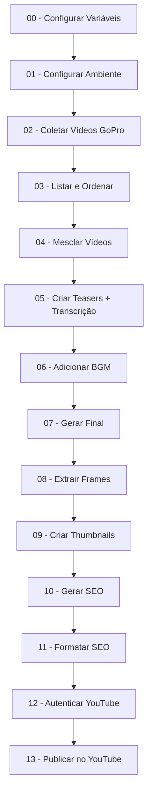

# FFmpeg Colab - Pipeline Completo de Edição e Publicação de Vídeos

Pipeline automatizado para edição de vídeos e publicação no YouTube usando Google Colab. Este notebook integra FFmpeg, OpenAI e YouTube API para processar vídeos desde o download até a publicação com SEO otimizado.

## 📋 Índice

- [Visão Geral](#visão-geral)
- [Recursos](#recursos)
- [Requisitos](#requisitos)
- [Estrutura do Pipeline](#estrutura-do-pipeline)
- [Configuração](#configuração)
- [Uso](#uso)
- [Estrutura de Pastas](#estrutura-de-pastas)
- [Tecnologias Utilizadas](#tecnologias-utilizadas)

## 🎯 Visão Geral

Este notebook do Google Colab automatiza todo o fluxo de trabalho de produção de vídeos, desde o download de arquivos da GoPro até a publicação no YouTube com metadados SEO otimizados e thumbnails personalizadas.

## ✨ Recursos

### 1. **Configuração de Ambiente**
- Instalação automática de Chrome, FFmpeg e ExifTool
- Configuração de variáveis de ambiente
- Montagem do Google Drive
- Gerenciamento de estrutura de pastas

### 2. **Download de Vídeos**
- Download automático de vídeos compartilhados via GoPro
- Suporte para qualidade original (4K) ou compactada
- Detecção automática de interface em português/inglês
- Download headless com Selenium

### 3. **Processamento de Vídeos**
- **Listagem e Ordenação**: Organiza vídeos por nome
- **Mesclagem**: Concatena múltiplos vídeos com keyframes otimizados
- **Teasers**: Cria teasers com transcrição via OpenAI Whisper
- **Música de Fundo**: Adiciona BGM direto do Google Drive
- **Finalização**: Gera vídeo final com copy puro

### 4. **Extração de Frames**
- Extração rápida e precisa de frames em 2 estágios
- Geração de manifests JSON com metadados

### 5. **Geração de Thumbnails**
- Criação de thumbnails profissionais com:
  - Fundo com efeito vignette
  - Ícone de localização (pin) com texto
  - Mini-fotos rotacionadas com bordas arredondadas
  - Headlines em caixas brancas/laranjas
  - Barra xadrez inferior
- Suporte para 3 variações de texto por thumbnail
- Layout fixo e consistente

### 6. **SEO Automatizado**
- Geração de metadados via OpenAI GPT:
  - Título otimizado (máx. 100 caracteres)
  - Descrição em 3 parágrafos
  - 10 hashtags relevantes
  - Tags de pesquisa (máx. 500 caracteres)
  - Categoria do YouTube
- Formatação automática com links do canal
- Validação de JSON

### 7. **Publicação no YouTube**
- Autenticação OAuth2 robusta
- Upload de vídeo com metadados
- Aplicação automática de thumbnail
- Suporte para múltiplos níveis de privacidade
- Log detalhado de uploads

## 📦 Requisitos

### APIs e Chaves
- **OpenAI API Key**: Para transcrição (Whisper) e geração de SEO (GPT-4o-mini)
- **Google Cloud Credentials**: Para autenticação YouTube (client_secret JSON)

### Dependências Python
```
selenium
webdriver-manager
openai>=1.30.0
google-auth-oauthlib>=1.2.0
google-api-python-client>=2.0.0
Pillow
```

### Ferramentas do Sistema
- Google Chrome
- FFmpeg 4.4+
- ExifTool 12.40+

## 🔄 Estrutura do Pipeline



## ⚙️ Configuração

### 1. Variáveis de Ambiente (Célula 00)

```python
# URL compartilhada da GoPro
GOPRO_URL_DEFAULT = "https://gopro.com/v/..."

# Modo de download: "original" ou "compressed"
os.environ["GOPRO_DL_MODE"] = "compressed"

# API Key da OpenAI
os.environ["OPENAI_API_KEY"] = "sk-proj-..."

# Modelos OpenAI
OPENAI_WHISPER = "whisper-1"
OPENAI_GPT = "gpt-4o-mini"
```

### 2. Opções de Configuração (Célula 01)

```python
MAKE_COMPAT_LINKS = False  # Criar atalhos legados
HARD_RESET = True          # Limpar pastas ao iniciar
```

## 🚀 Uso

### Execução Passo a Passo

1. **Configure as variáveis** (Célula 00)
2. **Execute a configuração do ambiente** (Célula 01)
3. **Faça download dos vídeos da GoPro** (Célula 04)
4. **Liste e ordene os arquivos** (Célula seguinte)
5. **Mescle os vídeos** (Célula de mesclagem)
6. **Crie teasers com transcrição** (Célula de teasers)
7. **Adicione música de fundo** (Célula BGM)
8. **Gere o vídeo final** (Célula final)
9. **Extraia frames** (Célula de frames)
10. **Crie thumbnails** (2 células: plano + renderização)
11. **Gere SEO com OpenAI** (Célula SEO)
12. **Formate os metadados** (Célula formatação)
13. **Autentique no YouTube** (Célula autenticação)
14. **Publique o vídeo** (Célula upload)

### Parâmetros Principais

#### Thumbnails (Células 17-18)
```python
# Definir textos para as 3 variações
variants_texts = [
    {
        "location_title": "Aeroporto de Congonhas",
        "location_subtitle": "Rumo a Curitiba",
        "head_top": "Voo Tranquilo",
        "head_bottom": "Aventura em Curitiba"
    },
    # ... mais 2 variações
]
```

#### Upload YouTube (Célula 24)
```python
VIDEO_NAME = "20251117_134644_FINAL.mp4"
SEO_INDEX = 1           # Qual bloco de SEO usar (1-3)
THUMB_INDEX = 1         # Qual thumbnail usar (1-3)
PRIVACY_STATUS = "unlisted"  # public | unlisted | private
```

## 📁 Estrutura de Pastas

```
/content/
├── 01 - Downloads/          # Vídeos baixados da GoPro
├── 02 - Mesclado/           # Vídeos mesclados
├── 03 - Teasers/            # Teasers + transcrições
├── 04 - Assets/             # Músicas de fundo (BGM)
├── 05 - Final/              # Vídeos finais processados
├── 06 - Frames/             # Frames extraídos + manifests
├── 07 - Thumbnails/         # Thumbnails geradas
├── 08 - SEO/                # Metadados SEO (JSON)
├── 09 - Youtube/            # Credenciais e logs de upload
│   ├── api-youtube/         # client_secret JSON
│   └── token/               # token.json OAuth
└── 99 - Drive/              # Google Drive montado
```

## 🛠️ Tecnologias Utilizadas

### Processamento de Vídeo
- **FFmpeg**: Mesclagem, corte, transcodificação
- **ExifTool**: Metadados de arquivos

### Automação Web
- **Selenium**: Download automatizado da GoPro
- **Chrome WebDriver**: Navegação headless

### Inteligência Artificial
- **OpenAI Whisper**: Transcrição de áudio
- **OpenAI GPT-4o-mini**: Geração de metadados SEO

### Processamento de Imagens
- **Pillow (PIL)**: Criação de thumbnails personalizadas
- **Fontes Google**: Calistoga (headlines)

### APIs e Autenticação
- **YouTube Data API v3**: Upload de vídeos
- **Google OAuth2**: Autenticação segura
- **Google Drive API**: Armazenamento

### Linguagem e Ambiente
- **Python 3**: Linguagem principal
- **Google Colab**: Ambiente de execução
- **Jupyter Notebook**: Interface

## 📝 Observações

### Limitações
- A API oficial do YouTube Data API v3 não suporta teste A/B de thumbnails (apenas 1 thumbnail por vídeo)
- Downloads da GoPro dependem da estrutura HTML do site (pode quebrar se mudarem a interface)
- Transcrição via Whisper consome créditos da OpenAI

### Boas Práticas
- Sempre execute a célula de configuração (01) antes de outras células
- Mantenha o Google Drive montado durante todo o processo
- Verifique os manifests JSON gerados em cada etapa
- Teste uploads no modo "unlisted" antes de publicar

### Segurança
- **NUNCA** commite arquivos com API keys no Git
- Use variáveis de ambiente ou arquivos JSON locais
- O token OAuth é salvo em `/content/09 - Youtube/token/token.json`
- Arquivos em `/content/` são temporários no Colab (apagados após sessão)

## 📄 Licença

Este projeto é fornecido "como está" para uso pessoal e educacional.

## 🤝 Contribuições

Sinta-se à vontade para:
- Reportar bugs
- Sugerir melhorias
- Adaptar para seu fluxo de trabalho

## 📧 Contato

Para dúvidas sobre o notebook, consulte os comentários nas células ou a documentação das APIs utilizadas.

---

**Desenvolvido para automatizar o fluxo de produção de vídeos do YouTube** 🎬
